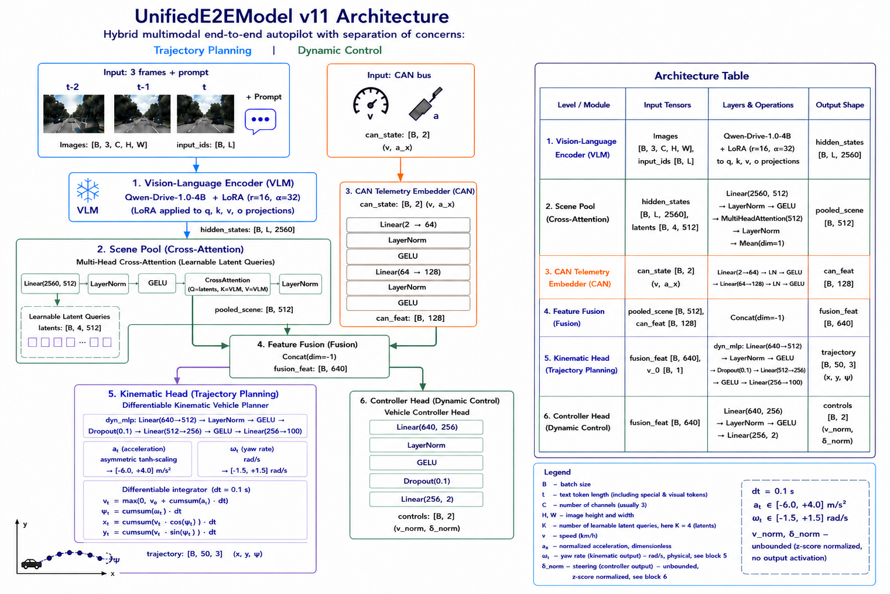
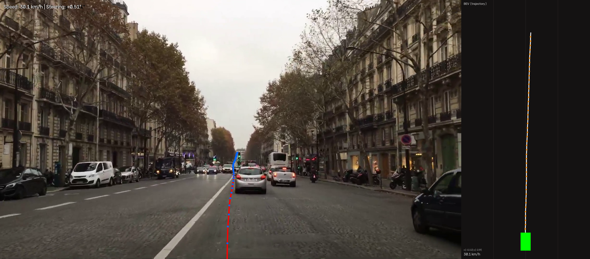
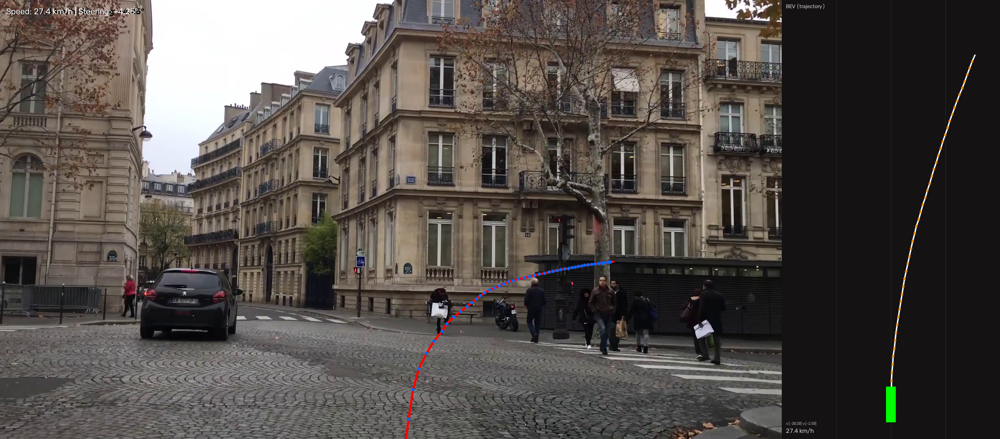
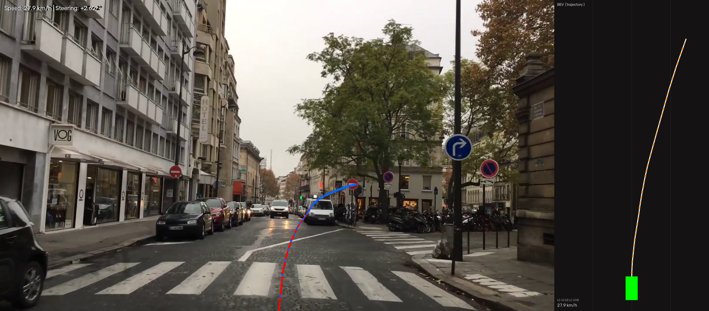
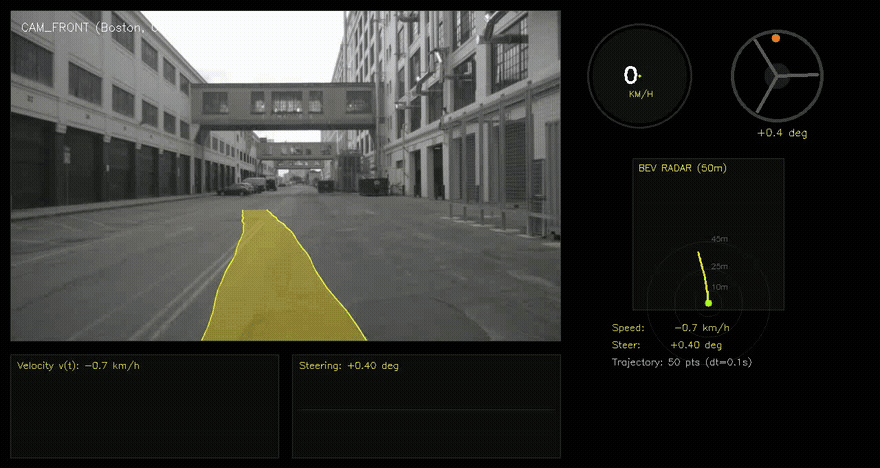

# Qwen-Drive Kinematic Planner (v11)

An end-to-end Vision-Language-Action (VLA) trajectory planning model for autonomous driving. The model is a LoRA fine-tune of the Qwen-Drive-1.0-4B vision-language backbone, combined with a differentiable kinematic vehicle planner, trained on the nuScenes dataset.

Model weights and the base VLM checkpoint are hosted on Hugging Face:
`https://huggingface.co/Aleton/Qwen-Drive-Kinematic-Planner`

## Overview

Direct regression of future (x, y) coordinates is prone to spatial discontinuities and dynamically infeasible trajectories, particularly over multi-second horizons. This model instead predicts physically bounded longitudinal acceleration and yaw rate signals over a 5.0-second horizon (50 steps, Δt = 0.1 s). The trajectory (x, y, ψ) is obtained by integrating these signals through a differentiable unicycle kinematic model, which guarantees smoothness and dynamic feasibility by construction.

## Architecture



### Pipeline Summary

| Stage | Module | Input | Operations | Output |
|---|---|---|---|---|
| 1 | Vision-Language Encoder | Images, input_ids | Qwen-Drive-1.0-4B + LoRA (r=16, α=32) on q/k/v/o_proj | hidden_states [B, L, 2560] |
| 2 | Scene Pool | hidden_states | Linear(2560→512) → LayerNorm → GELU → Cross-Attention (4 learnable queries) → LayerNorm → mean | pooled_scene [B, 512] |
| 3 | CAN Telemetry Embedder | can_state [B, 2] (speed_kmh, accel_norm) | Linear(2→64) → LayerNorm → GELU → Linear(64→128) → LayerNorm → GELU | can_feat [B, 128] |
| 4 | Feature Fusion | pooled_scene, can_feat | Concatenation | fusion_feat [B, 640] |
| 5 | Kinematic Planner | fusion_feat, v0 | Linear(640→512) → LayerNorm → GELU → Dropout(0.1) → Linear(512→256) → GELU → Linear(256→100) → asymmetric tanh-scaling → differentiable integrator | trajectory [B, 50, 3] |
| 6 | Controller Head | fusion_feat | Linear(640→256) → LayerNorm → GELU → Dropout(0.1) → Linear(256→2) | controls [B, 2] |

### Differentiable Kinematic Integration

The kinematic planner predicts per-step acceleration a_t and yaw rate ω_t, constrained via tanh scaling:

- a_t ∈ [-6.0, +4.0] m/s² (asymmetric: braking limit exceeds acceleration limit)
- ω_t ∈ [-1.5, +1.5] rad/s

These are integrated as:

```
v_t = max(0, v0 + Σ_{τ=1..t} a_τ · Δt)
ψ_t = Σ_{τ=1..t} ω_τ · Δt
x_t = Σ_{τ=1..t} v_τ · cos(ψ_τ) · Δt
y_t = Σ_{τ=1..t} v_τ · sin(ψ_τ) · Δt
```

All operations are differentiable. Gradients from the trajectory loss propagate through the integrator into the predicted control signals and further into the visual and CAN features. No direct supervision on a_t or ω_t is required.

The controller head output (target speed, steering angle) is unbounded and represents z-score normalized regression targets. Denormalization requires the `speed_mean`, `speed_std`, `steer_mean`, `steer_std` statistics stored in the checkpoint.

## Model Outputs

Given three consecutive front-camera frames and current CAN telemetry, the model produces:

1. **Direct control commands** (controller head): target longitudinal speed (km/h) and steering angle (radians/degrees), denormalized using training-set statistics.
2. **Kinematic motion parameters** (kinematic planner, internal): acceleration profile a_1...a_50 and yaw rate profile ω_1...ω_50.
3. **Integrated trajectory**: future ego waypoints (x, y, ψ) for 50 steps over a 5.0-second horizon, obtained via kinematic integration of the above signals.

## Design Choices

- **Temporal context**: three consecutive CAM_FRONT frames (t-2, t-1, t).
- **Timeline synchronization**: trajectories are constructed from sensor-rate `sample_data` timestamps (approximately 12 Hz) rather than the 2 Hz keyframe grid, then linearly interpolated to a fixed Δt = 0.1 s grid.
- **Trajectory validity filtering**: samples are discarded if less than 80% of the 5.0-second horizon is covered by available future poses, or if required historical frames are missing on disk.
- **Jerk regularization**: an additional loss term penalizes the third time derivative of position to encourage trajectory smoothness.
- **Time-weighted trajectory loss**: per-step loss weights increase linearly from 0.8 (t = 0.1 s) to 2.0 (t = 5.0 s).

## Benchmarks

Evaluated on the nuScenes v1.0-trainval validation split.

| Metric | Baseline (direct xy regression) | v11 (this model) |
|---|---|---|
| FDE (5.0 s) | ~40.78 m | 5.63 m |
| ADE (0-5.0 s, averaged) | ~30.14 m | 2.19 m |
| Speed MAE | ~7.40 km/h | 1.60 km/h |
| Steering Angle MAE | ~0.080 rad | 0.0167 rad (~0.95°) |

The baseline uses an identical backbone and training pipeline, with the kinematic planner replaced by direct MLP regression of (x, y) coordinates. This is an internal ablation and not a comparison against third-party methods.

ADE is averaged over the full 0-5.0 s horizon (50 steps). FDE is computed only at t = 5.0 s. These figures are not directly comparable to ADE@5s metrics reported by systems that evaluate only the endpoint.

## Qualitative Results

| Result 1 | Result 2 | Result 3 |
|---|---|---|
|  |  |  |



## Training Details

| Parameter | Value |
|---|---|
| Dataset | nuScenes v1.0-trainval |
| Hardware | NVIDIA A100 |
| LoRA | r=16, α=32, dropout=0.05, targets: q/k/v/o_proj |
| Learning rate (backbone / heads) | 4e-6 / 4e-4 |
| Effective batch size | 8 × 2 (gradient accumulation) = 16 |
| Epochs / early-stopping patience | up to 10 / patience = 4 (monitored on validation FDE) |
| Scheduler | cosine with warmup (warmup_ratio = 0.08) |
| Precision | bfloat16 |
| Loss weights | speed = 1.0, steer = 0.3, trajectory = 0.25, jerk = 0.05 |
| Base regression loss | Smooth L1 (Huber) |
| Image resolution | 384 × 384, 3 temporal frames |
| Gradient clipping | max norm 1.0 |

Training code is not included in this repository.

## Repository Contents

| File | Description |
|---|---|
| `model.py` | `UnifiedE2EModel` definition: VLM wrapper, scene pooling, CAN embedder, kinematic planner, controller head. |
| `best_autopilot_v11.pt` | Trained checkpoint (~24 MB): LoRA adapter weights, head weights, normalization statistics. |
| `archi.png` | Architecture diagram. |
| `result1.png`, `result2.png`, `result3.png` | Qualitative trajectory prediction examples. |
| `simulation.gif` | Simulated driving sequence with overlaid trajectory and control outputs. |

## Checkpoint Contents

`best_autopilot_v11.pt` contains:

- `lora_state_dict`: LoRA adapter weights for the Qwen-Drive-1.0 VLM attention projections (q_proj, k_proj, v_proj, o_proj).
- `head_state_dict`: weights for `scene_proj`, `cross_attn`, `cross_norm`, `dyn_embed`, `kinematic_planner`, `controller`.
- `stats`: normalization parameters (`speed_mean`, `speed_std`, `steer_mean`, `steer_std`) computed on the training split.

## Installation

```bash
git clone https://github.com/QwenLM/Qwen-Drive-1.0 qwen-drive
cd qwen-drive && pip install -e . --no-build-isolation
hf download Qwen/Qwen-Drive-1.0-4B --local-dir Qwen-Drive-1.0-4B
pip install torch peft huggingface_hub pillow
```

## Usage

```python
import sys
import torch
from transformers import AutoTokenizer
from peft import LoraConfig, get_peft_model, set_peft_model_state_dict

sys.path.append("./qwen-drive/src")
from qwen_drive import QwenDriveConfig, QwenDriveProcessor, QwenDriveForPlanning
from model import UnifiedE2EModel

QWEN_DRIVE_PATH = "./Qwen-Drive-1.0-4B"
CKPT_PATH = "./best_autopilot_v11.pt"
device = "cuda" if torch.cuda.is_available() else "cpu"

ckpt = torch.load(CKPT_PATH, map_location=device)
stats = ckpt["stats"]

base_model = QwenDriveForPlanning.from_pretrained(
    QWEN_DRIVE_PATH, dtype=torch.bfloat16, attn_implementation="sdpa",
)
vlm_core = getattr(base_model, "vlm", getattr(base_model, "model", base_model))

tokenizer = AutoTokenizer.from_pretrained(QWEN_DRIVE_PATH)
if tokenizer.pad_token is None:
    tokenizer.pad_token = tokenizer.eos_token

config_qwen = QwenDriveConfig.from_pretrained(QWEN_DRIVE_PATH)
processor = QwenDriveProcessor(tokenizer, config_qwen)

lora_config = LoraConfig(
    r=16, lora_alpha=32,
    target_modules=["q_proj", "k_proj", "v_proj", "o_proj"],
    lora_dropout=0.05, bias="none", task_type="CAUSAL_LM",
)
vlm_lora = get_peft_model(vlm_core, lora_config)
set_peft_model_state_dict(vlm_lora, ckpt["lora_state_dict"])

model = UnifiedE2EModel(vlm_lora, hidden_dim=512, traj_points=50, traj_dt=0.1).to(device)
model.load_state_dict(ckpt["head_state_dict"], strict=False)
model.eval()

encoded = processor.encode_vqa(
    images=[...],  # three PIL.Image frames: [t-2, t-1, t]
    question="Predict future trajectory and vehicle control signals.",
)
inputs = {k: v.to(device) for k, v in encoded.items()}
inputs["attention_mask"] = torch.ones_like(inputs["input_ids"])
inputs["mm_token_type_ids"] = (inputs["input_ids"] == processor.image_token_id).long()
inputs["can_state"] = torch.tensor([[36.0, 0.0]], dtype=torch.float32, device=device)

with torch.no_grad():
    outputs = model(**inputs)

trajectory = outputs["trajectory"][0].cpu().numpy()
controls = outputs["controls"][0].cpu().numpy()
target_speed_kmh = controls[0] * stats["speed_std"] + stats["speed_mean"]
steer_angle_rad = controls[1] * stats["steer_std"] + stats["steer_mean"]

print(f"Target Speed : {target_speed_kmh:.1f} km/h")
print(f"Steering     : {torch.rad2deg(torch.tensor(steer_angle_rad)):+.2f} deg")
```

The prompt string used during training must be reproduced exactly at inference time:

```
Predict future trajectory and vehicle control signals.
```

Using a different or empty prompt shifts the VLM hidden states outside the distribution the planning and control heads were fitted to, and is expected to degrade output quality.

## Intended Use

This is a research prototype for studying kinematically constrained trajectory planning in vision-language-action models. It is trained and evaluated exclusively on nuScenes front-camera data.

Out of scope: real-world deployment, use as a safety-critical driving system, or use with sensor configurations or geographies not represented in nuScenes. Predictions have not been validated in closed-loop or real-vehicle settings.

## Limitations

- **Single camera field of view**: uses only the front camera (CAM_FRONT); side and rear blind spots are not monitored.
- **Simplified dynamic model**: a unicycle kinematic model is used; lateral tire slip, roll/pitch dynamics, and road-surface interaction are not modeled.
- **Telemetry dependency**: the integrator relies on accurate CAN telemetry (v0) as its initial condition; degraded telemetry biases the entire predicted trajectory.
- **Dataset generalization**: evaluated only on nuScenes v1.0-trainval; generalization to other sensor setups, geographies, or weather conditions is untested.
- **Label noise**: ADE/FDE are computed against nuScenes ego-pose ground truth interpolated from sensor-rate timestamps; label noise in ego-pose is not separately quantified.

## License

Code and architecture: Apache-2.0.
Model weights (`best_autopilot_v11.pt`): non-commercial / research use only, inheriting the license terms of the nuScenes dataset (CC BY-NC-SA 4.0).

## Citation

```bibtex
@misc{aleton2026qwendrivev11,
  title={Qwen-Drive Kinematic Planner (v11): Differentiable Kinematic Trajectory Planning on nuScenes},
  author={Vishnevskiy, Aleksey},
  year={2026},
  publisher={Hugging Face},
  howpublished={\url{https://huggingface.co/Aleton/Qwen-Drive-Kinematic-Planner}}
}

@misc{zhou2026qwendrive10,
  title={Qwen-Drive-1.0: An Initial Step towards a Vision-Language Foundation Model for Autonomous Driving},
  author={Xin Zhou and Zongchuang Zhao and Zhibo Yang and Mingsheng Li and Humen Zhong and
          Shuai Bai and Du Chu and Ruizhe Chen and Zhaohai Li and Jun Tang and Qiuyue Wang and
          Mingkun Yang and Jiazhao Zhang and Dayiheng Liu and Dingkang Liang and Xiang Bai},
  year={2026},
  eprint={2609.00111},
  archivePrefix={arXiv},
  primaryClass={cs.CV},
  url={https://arxiv.org/abs/2609.00111}
}

@article{nuscenes2019,
  title={nuScenes: A multimodal dataset for autonomous driving},
  author={Holger Caesar and Varun Bankiti and Alex H. Lang and Sourabh Vora and
          Venice Erin Liong and Qiang Xu and Anush Krishnan and Yu Pan and
          Giancarlo Baldan and Oscar Beijbom},
  journal={arXiv preprint arXiv:1903.11027},
  year={2019}
}
```
